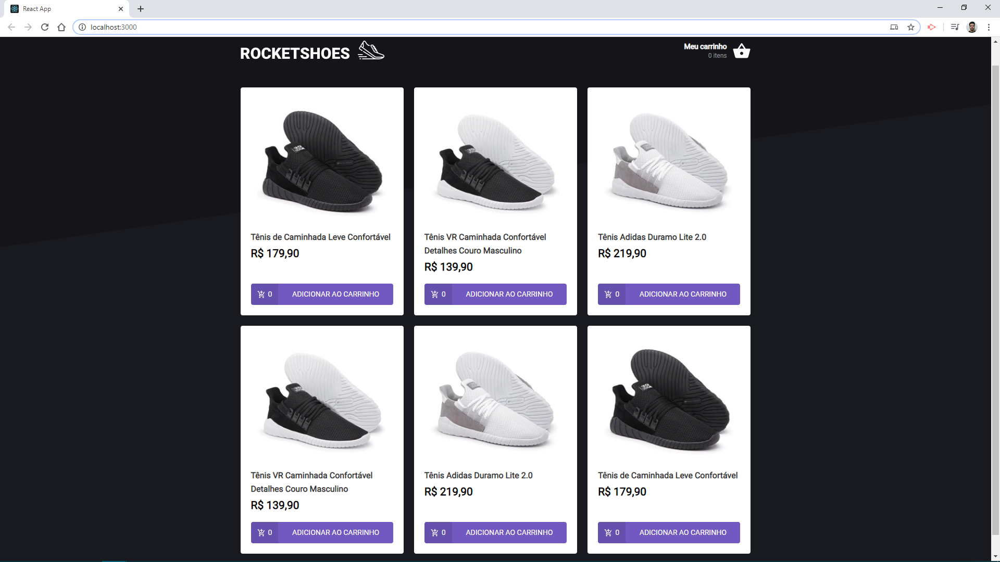
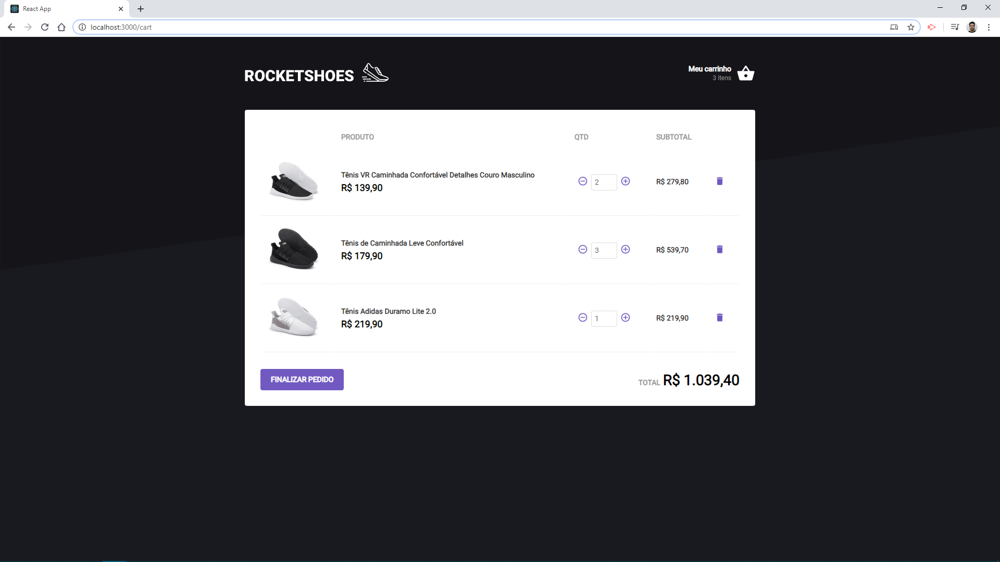

<h1 align="center">
    
</h1>

<h3>
  Desafio 7: Arquitetura Flux
</h3>

...

<h1 align="center">
    
    
</h1>

## :rocket: Tecnologias

Esse projeto foi desenvolvido no Bootcamp GoStack da Rocketseat com as seguintes tecnologias:

-  [ReactJS](https://reactjs.org/)
-  [Redux](https://redux.js.org/)
-  [Redux-Saga](https://redux-saga.js.org/)
-  [React Router v4](https://github.com/ReactTraining/react-router)
-  [Axios](https://github.com/axios/axios)
-  [History](https://www.npmjs.com/package/history)
-  [Immer](https://github.com/immerjs/immer)
-  [Polished](https://polished.js.org/)
-  [React-Toastify](https://fkhadra.github.io/react-toastify/)
-  [styled-components](https://www.styled-components.com/)
-  [React-Icons](https://react-icons.netlify.com/)
-  [react-loading-skeleton](https://github.com/dvtng/react-loading-skeleton)
-  [react-loader-spinner](https://github.com/mhnpd/react-loader-spinner)
-  [json-server](https://github.com/typicode/json-server)
-  [Reactotron](https://infinite.red/reactotron)
-  VS Code com EditorConfig, Eslint e Prettier para padronização de código

## :information_source: Como executar este projeto

```bash
# Clone este repositório
$ git clone https://github.com/geovanicv/rocketshoes-react

# Navegue até a pasta
$ cd rocketshoes-react

# Instale as dependências
$ yarn install

# Execute o app
$ yarn start
```
